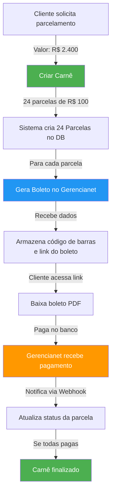

# Integração Gerencianet - Carnês e Boletos

## Visão Geral

Este documento descreve como integrar boletos e carnês (planos de pagamento parcelado) usando a API Gerencianet.

### O que é Gerencianet?

Gerencianet é uma gateway de pagamento brasileira que oferece:
- ✅ Geração de boletos bancários
- ✅ Recorrências (carnês/assinaturas)
- ✅ Notificações de pagamento via webhook
- ✅ API REST para integração

## Setup Inicial

### 1. Criar Conta no Gerencianet

1. Acesse [https://gerencianet.com.br](https://gerencianet.com.br)
2. Crie uma conta e faça login
3. Acesse **Aplicações** → **Minhas Aplicações**
4. Crie uma nova aplicação e obtenha:
   - `Client ID`
   - `Client Secret`

### 2. Configurar Variáveis de Ambiente

Adicione ao arquivo `.env`:

```env
# Gerencianet
GERENCIANET_CLIENT_ID=seu_client_id_aqui
GERENCIANET_CLIENT_SECRET=seu_client_secret_aqui
GERENCIANET_SANDBOX=true  # Use true para testes, false para produção

# URL da aplicação (para webhooks)
APP_URL=http://localhost:8000
```

### 3. Instalar Dependências

```bash
pip install requests
```

## Estrutura de Dados

### Tabelas Criadas

```
┌─────────────────┐
│   CARNES        │  Planos de pagamento parcelado
├─────────────────┤
│ id (PK)         │
│ cliente_id      │
│ numero_carne    │
│ valor_total     │
│ qtd_parcelas    │
│ valor_parcela   │
│ status          │
│ gerencianet_id  │
└─────────────────┘
      ↓
      │ 1:N
      ↓
┌─────────────────┐
│  PARCELAS       │  Cada parcela do carnê
├─────────────────┤
│ id (PK)         │
│ carne_id (FK)   │
│ numero_parcela  │
│ valor           │
│ data_vencimento │
│ status          │
│ gerencianet_id  │
│ codigo_barras   │
│ linha_digitavel │
└─────────────────┘

┌─────────────────┐
│   BOLETOS       │  Boletos (fatura única ou parcela)
├─────────────────┤
│ id (PK)         │
│ cliente_id (FK) │
│ fatura_id (FK)  │  Opcional
│ parcela_id (FK) │  Opcional
│ numero_boleto   │
│ valor           │
│ status          │
│ gerencianet_id  │
│ codigo_barras   │
│ linha_digitavel │
│ url_boleto      │
└─────────────────┘
```

## Casos de Uso

### 1. Criar um Carnê (Plano de Pagamento)

**Cenário**: Cliente quer pagar uma fatura de R$ 1.200 em 12 parcelas

```python
from crm_modules.faturamento.carne_schemas import CarneCreate
from datetime import date

# Criar carnê
carne_data = CarneCreate(
    cliente_id=123,
    valor_total=1200.00,
    quantidade_parcelas=12,
    data_inicio=date(2024, 1, 1),
    data_primeiro_vencimento=date(2024, 2, 1),
    intervalo_dias=30,  # Mensal
    descricao="Serviços de consultoria",
    gerar_boletos=True  # Gerar boletos automaticamente
)

response = POST /api/faturamento/carnes
# Response:
{
    "id": 1,
    "numero_carne": "CARNE-20240101-0123-001",
    "valor_total": 1200.00,
    "quantidade_parcelas": 12,
    "valor_parcela": 100.00,
    "parcelas": [
        {
            "id": 1,
            "numero_parcela": 1,
            "valor": 100.00,
            "data_vencimento": "2024-02-01",
            "status": "pendente",
            "codigo_barras": "12345.67890 12345.678901 12345.678901 1 12345678901234",
            "linha_digitavel": "12345.67890 12345.678901...",
            "gerencianet_link_boleto": "https://link-do-boleto.gerencianet.com.br/..."
        },
        ...  // 12 parcelas no total
    ]
}
```

**API Endpoint**:
```
POST /api/faturamento/carnes
Content-Type: application/json

{
    "cliente_id": 123,
    "valor_total": 1200.00,
    "quantidade_parcelas": 12,
    "data_inicio": "2024-01-01",
    "data_primeiro_vencimento": "2024-02-01",
    "intervalo_dias": 30,
    "descricao": "Serviços de consultoria",
    "gerar_boletos": true
}
```

### 2. Gerar um Boleto para uma Fatura

**Cenário**: Cliente quer pagar uma fatura única com boleto

```python
# Gerar boleto para fatura existente
response = POST /api/faturamento/faturas/{fatura_id}/boleto?juros_dia=0.05&multa_atraso=2.0

# Response:
{
    "id": 1,
    "numero_boleto": "BOL-20240101-0123-0001",
    "valor": 1500.00,
    "data_vencimento": "2024-02-15",
    "status": "pendente",
    "codigo_barras": "12345.67890 12345.678901 12345.678901 1 12345678901234",
    "linha_digitavel": "12345.67890 12345.678901...",
    "url_boleto": "https://gerencianet.com.br/boleto/...",
    "gerencianet_status": "aberto"
}
```

### 3. Gerar um Boleto Direto (Sem Fatura)

```python
response = POST /api/faturamento/boletos

{
    "cliente_id": 123,
    "valor": 500.00,
    "data_vencimento": "2024-02-20",
    "descricao": "Pagamento adicional",
    "juros_dia": 0.05,
    "multa_atraso": 2.0
}
```

### 4. Listar Parcelas de um Carnê

```python
response = GET /api/faturamento/carnes/{carne_id}/parcelas

# Response:
[
    {
        "id": 1,
        "numero": 1,
        "valor": 100.00,
        "data_vencimento": "2024-02-01",
        "status": "pendente",
        "valor_pago": 0.0,
        "codigo_barras": "...",
        "linha_digitavel": "...",
        "link_boleto": "https://..."
    },
    ...
]
```

### 5. Registrar Pagamento de uma Parcela

```python
response = POST /api/faturamento/parcelas/{parcela_id}/pagar?valor_pago=100.0

# Response:
{
    "message": "Pagamento registrado com sucesso"
}
```

### 6. Sincronizar Boletos com Gerencianet

```python
# Sincronizar um boleto específico
response = PUT /api/faturamento/boletos/{boleto_id}/sincronizar

# Ou sincronizar todos os boletos abertos
response = POST /api/faturamento/boletos/sincronizar/todos

# Response:
{
    "message": "15 boletos sincronizados",
    "boletos_sincronizados": 15
}
```

### 7. Cancelar um Carnê

```python
response = DELETE /api/faturamento/carnes/{carne_id}/cancelar

# Response:
{
    "id": 1,
    "numero_carne": "CARNE-20240101-0123-001",
    "status": "cancelado",
    ...
}
```

## Webhooks

Gerencianet envia notificações para sua aplicação quando eventos ocorrem:

### Webhook de Boleto

**URL de Notificação**:
```
POST /api/faturamento/webhooks/gerencianet/boleto
```

**Payload do Gerencianet**:
```json
{
    "id": 12345,
    "status": "paid",
    "amount": 100000,
    "paid_at": "2024-01-15T10:30:00Z",
    ...
}
```

**Status Possíveis**:
- `paid` - Boleto pago
- `canceled` - Boleto cancelado
- `overdue` - Boleto vencido
- `pending` - Boleto pendente

### Webhook de Recorrência

**URL de Notificação**:
```
POST /api/faturamento/webhooks/gerencianet/subscription
```

## Fluxo Completo de Exemplo

### Cenário: Cliente quer pagar R$ 2.400 em 24 parcelas



## Configurando Webhooks no Gerencianet

1. Acesse sua conta Gerencianet
2. Vá em **Configurações** → **Webhooks**
3. Adicione as URLs:
   - `POST http://seu-app.com/api/faturamento/webhooks/gerencianet/boleto`
   - `POST http://seu-app.com/api/faturamento/webhooks/gerencianet/subscription`
4. Ative as notificações para:
   - Payment success
   - Payment failure
   - Charge overdue

## Testando no Sandbox

Gerencianet fornece um ambiente de testes. Use:

**Variáveis de Ambiente para Sandbox**:
```env
GERENCIANET_SANDBOX=true
APP_URL=http://localhost:8000  # Para webhooks
```

**Dados de Teste**:
- CPF: `94087216055`
- Email: `teste@sandboxgerencianet.com.br`

## Tratamento de Erros

### Erros Comuns

| Erro | Causa | Solução |
|------|-------|--------|
| `Invalid credentials` | Client ID/Secret incorretos | Verifique no painel Gerencianet |
| `Customer not found` | Cliente não existe no Gerencianet | Crie o cliente antes do boleto |
| `Invalid amount` | Valor inválido | Use centavos (multiplicar por 100) |
| `Webhook timeout` | URL não acessível | Configure APP_URL corretamente |
| `Duplicate reference` | Número de referência duplicado | Use números únicos |

## Monitoramento e Relatórios

### Dashboard de Boletos

```python
GET /api/faturamento/boletos/cliente/{cliente_id}

# Resposta com status:
{
    "total": 12,
    "pendentes": 8,
    "pagos": 4,
    "vencidos": 0,
    "valor_total": 1200.00,
    "valor_pago": 400.00,
    "boletos": [...]
}
```

### Boletos Vencidos

```python
GET /api/faturamento/boletos/vencidos/listar

# Resposta:
[
    {
        "id": 1,
        "numero_boleto": "BOL-20240101-0123-0001",
        "valor": 100.00,
        "data_vencimento": "2024-01-15",
        "dias_atraso": 15,
        "cliente_id": 123
    },
    ...
]
```

## Melhores Práticas

1. **Sincronizar Regularmente**: Use `POST /api/faturamento/boletos/sincronizar/todos` para sincronizar status
2. **Validar Dados do Cliente**: Sempre verifique email e CPF antes de gerar boleto
3. **Tratar Webhooks**: Implemente retry logic para webhooks falhos
4. **Logs**: Registre todas as transações com Gerencianet
5. **Teste Antes de Produção**: Use sandbox primeiro
6. **Backup de Dados**: Mantenha cópia do código de barras e linha digitável

## Segurança

- ✅ Não exponha Client ID/Secret no frontend
- ✅ Use HTTPS em produção
- ✅ Valide webhooks recebidos
- ✅ Use rates limiting nas APIs
- ✅ Criptografe dados sensíveis

## Próximos Passos

1. Integrar com sistema de email para enviar boletos aos clientes
2. Criar dashboard visual com status dos pagamentos
3. Implementar retry automático para boletos vencidos
4. Adicionar múltiplas formas de pagamento (PIX, cartão de crédito)
5. Gerar relatórios de recebimento

## Referências

- [Documentação Gerencianet](https://gerencianet.com.br/api)
- [Status de Transações](https://gerencianet.com.br/guias/status-transacoes)
- [Webhook Reference](https://gerencianet.com.br/webhooks)
