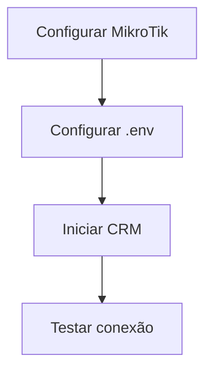
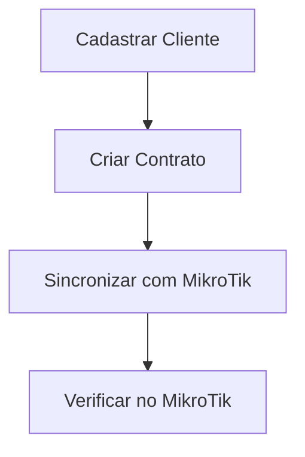
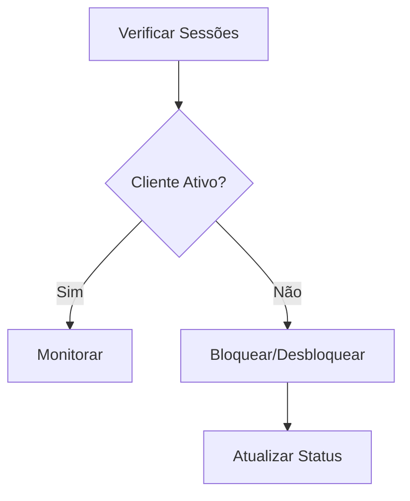

# Tutorial de Sincronização com MikroTik

Este tutorial ensina como configurar e usar a sincronização com MikroTik no CRM Provedor.

## 📋 Pré-requisitos

- MikroTik configurado e acessível via API
- Porta 8728 aberta no MikroTik
- Credenciais de administrador do MikroTik
- CRM Provedor instalado e configurado

## 🔧 Configuração Inicial

### 1. Configurar o MikroTik

No WinBox ou via terminal, configure o acesso à API:

```bash
# Habilitar API
/ip service set api disabled=no port=8728

# Verificar se está ativo
/ip service print
```

### 2. Configurar o .env

Edite o arquivo `.env` na raiz do projeto:

```env
# Configurações do MikroTik
MIKROTIK_HOST=192.168.1.1
MIKROTIK_USER=admin
MIKROTIK_PASSWORD=sua_senha_aqui
```

### 3. Configurar Servidor no Banco de Dados (Opcional)

Se preferir configurar via banco de dados:

```sql
INSERT INTO servidores (nome, ip, tipo_conexao, tipo_acesso, usuario, senha, ativo) 
VALUES ('MikroTik Principal', '192.168.1.1', 'mikrotik', 'api', 'admin', 'sua_senha', 1);
```

## 🚀 Como Sincronizar Clientes

### Via Dashboard (Interface Web)

1. **Acesse o Dashboard**
   - Abra o navegador e vá para `http://localhost:8000`
   - Faça login com suas credenciais

2. **Cadastre um Cliente**
   - No menu lateral, clique em "Cadastros" → "Novo Cliente"
   - Preencha os dados do cliente
   - Salve o cadastro

3. **Crie um Contrato**
   - No menu lateral, clique em "Provedor" → "Contratos"
   - Clique em "Novo Contrato"
   - Selecione o cliente criado
   - Preencha os dados do contrato:
     - Plano de internet
     - Velocidade de download/upload
     - Senha PPPoE
   - Salve o contrato

4. **Sincronize com MikroTik**
   - Após salvar o contrato, o sistema sincronizará automaticamente
   - Ou manualmente via API: `POST /api/v1/mikrotik/contratos/{id}/sync`

### Via API REST

#### Criar Profile PPPoE

```bash
curl -X POST "http://localhost:8000/api/v1/mikrotik/profiles" \
  -H "Authorization: Bearer seu_token_jwt" \
  -H "Content-Type: application/json" \
  -d '{
    "name": "premium",
    "download_limit": 100,
    "upload_limit": 50
  }'
```

#### Sincronizar Cliente

```bash
curl -X POST "http://localhost:8000/api/v1/mikrotik/clients/sync" \
  -H "Authorization: Bearer seu_token_jwt" \
  -H "Content-Type: application/json" \
  -d '{
    "cliente_id": 1,
    "contrato_id": 1
  }'
```

#### Sincronizar Contrato

```bash
curl -X POST "http://localhost:8000/api/v1/mikrotik/contratos/1/sync" \
  -H "Authorization: Bearer seu_token_jwt"
```

## 📊 Monitoramento

### Visualizar Logs do MikroTik

```bash
curl -X GET "http://localhost:8000/api/v1/mikrotik/logs?limit=10" \
  -H "Authorization: Bearer seu_token_jwt"
```

### Verificar Sessões Ativas

```bash
curl -X GET "http://localhost:8000/api/v1/mikrotik/sessions" \
  -H "Authorization: Bearer seu_token_jwt"
```

### Status do MikroTik

```bash
curl -X GET "http://localhost:8000/api/v1/mikrotik/status" \
  -H "Authorization: Bearer seu_token_jwt"
```

## 🔒 Gerenciamento de Clientes

### Bloquear Cliente

```bash
curl -X POST "http://localhost:8000/api/v1/mikrotik/clients/block" \
  -H "Authorization: Bearer seu_token_jwt" \
  -H "Content-Type: application/json" \
  -d '{
    "username": "cliente_teste_1"
  }'
```

### Desbloquear Cliente

```bash
curl -X POST "http://localhost:8000/api/v1/mikrotik/clients/unblock" \
  -H "Authorization: Bearer seu_token_jwt" \
  -H "Content-Type: application/json" \
  -d '{
    "username": "cliente_teste_1"
  }'
```

### Atualizar Credenciais

```bash
curl -X PUT "http://localhost:8000/api/v1/mikrotik/clients/credentials" \
  -H "Authorization: Bearer seu_token_jwt" \
  -H "Content-Type: application/json" \
  -d '{
    "username": "cliente_teste_1",
    "new_password": "nova_senha_segura",
    "new_profile": "premium"
  }'
```

## 🐛 Resolução de Problemas

### Erro: "MikroTik não configurado"

**Causa:** As variáveis de ambiente não estão definidas corretamente.

**Solução:**
1. Verifique o arquivo `.env`
2. Confira se as credenciais estão corretas
3. Reinicie o servidor

### Erro: "Conexão recusada"

**Causa:** Porta 8728 bloqueada ou MikroTik inacessível.

**Solução:**
1. Verifique se a API está habilitada no MikroTik
2. Confira o firewall
3. Teste a conexão com `telnet 192.168.1.1 8728`

### Erro: "Credenciais inválidas"

**Causa:** Usuário ou senha incorretos.

**Solução:**
1. Verifique as credenciais no MikroTik
2. Teste o login via WinBox
3. Atualize o `.env` com credenciais corretas

### Erro: "Profile já existe"

**Causa:** O profile já foi criado anteriormente.

**Solução:** O sistema atualiza automaticamente o profile existente.

## 📈 Fluxo de Trabalho Recomendado

### 1. Configuração Inicial


### 2. Cadastro de Novo Cliente


### 3. Gerenciamento de Clientes


## 🛠️ Comandos Úteis

### Testar Conexão Manualmente

```python
from crm_modules.mikrotik.services import MikrotikService

service = MikrotikService()
result = service.obter_configuracoes()
print(result)
```

### Verificar Logs no Terminal

```bash
# Iniciar o servidor com logs detalhados
python -m uvicorn interfaces.api.main:app --host 0.0.0.0 --port 8000 --log-level debug
```

### Testar API Localmente

```bash
# Testar status
curl -X GET "http://localhost:8000/api/v1/mikrotik/status"

# Testar criação de profile
curl -X POST "http://localhost:8000/api/v1/mikrotik/profiles" \
  -H "Content-Type: application/json" \
  -d '{"name": "test", "download_limit": 10, "upload_limit": 5}'
```

## 📞 Suporte

Se encontrar problemas:

1. **Verifique os logs** do CRM
2. **Teste a conexão** com o MikroTik
3. **Consulte o dashboard** para status
4. **Use os endpoints** de teste

### Comandos de Diagnóstico

```bash
# Verificar status do MikroTik
curl -X GET "http://localhost:8000/api/v1/mikrotik/status"

# Verificar logs recentes
curl -X GET "http://localhost:8000/api/v1/mikrotik/logs?limit=5"

# Testar criação de profile
curl -X POST "http://localhost:8000/api/v1/mikrotik/profiles" \
  -H "Content-Type: application/json" \
  -d '{"name": "diagnostico", "download_limit": 1, "upload_limit": 1}'
```

## ✅ Checklist de Configuração

- [ ] MikroTik com API habilitada na porta 8728
- [ ] Credenciais de administrador corretas
- [ ] Arquivo `.env` configurado
- [ ] CRM Provedor iniciado
- [ ] Teste de conexão realizado
- [ ] Primeiro cliente sincronizado
- [ ] Dashboard acessível
- [ ] Logs sendo coletados

Pronto! Agora você tem tudo configurado para sincronizar clientes com o MikroTik de forma automática e em tempo real.