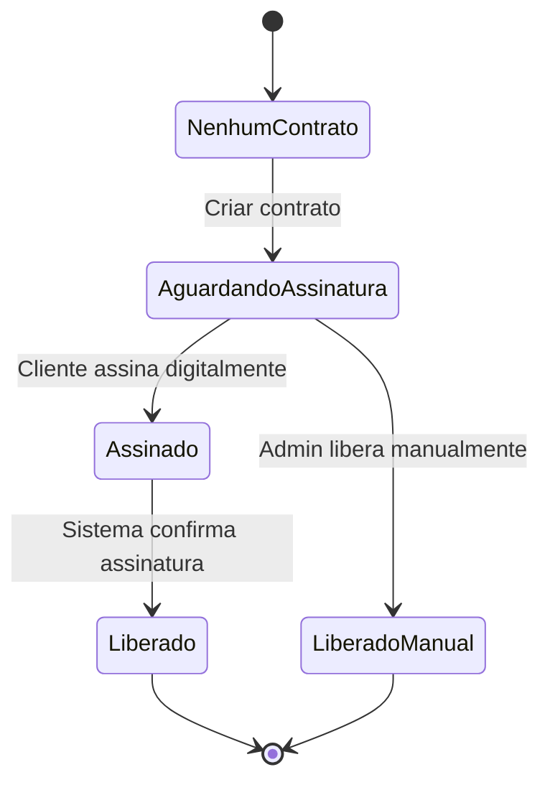

# Sistema de Contratos com Assinatura Digital

## Visão Geral
Implementar sistema completo de contratos para clientes, incluindo gerenciamento de status de assinatura digital e liberação manual.

## Arquitetura Proposta

### 1. Modelo de Dados

**Tabela: contratos**
```sql
id INTEGER PRIMARY KEY
cliente_id INTEGER (FK clientes.id)
titulo VARCHAR
descricao TEXT
status_assinatura ENUM ('aguardando', 'assinado', 'liberado')
data_criacao DATETIME
data_assinatura DATETIME NULL
arquivo_contrato VARCHAR (path para PDF)
hash_assinatura VARCHAR NULL
assinatura_digital BLOB NULL
observacoes TEXT
```

**Alteração na tabela clientes:**
```sql
ALTER TABLE clientes ADD COLUMN status_contrato VARCHAR DEFAULT 'nenhum';
```

### 2. Fluxo de Assinatura



### 3. Componentes a Implementar

#### Backend
- **Models**: ContratoModel (SQLAlchemy)
- **Schemas**: ContratoCreate, ContratoUpdate, ContratoResponse
- **Repository**: ContratoRepository
- **Domain**: Contrato (dataclass)
- **Service**: ContratoService
- **API**: Endpoints para CRUD, assinatura digital, liberação manual

#### Frontend
- **Status no login**: Banner informativo se aguardando assinatura
- **Dashboard cliente**: Lista de contratos com status
- **Admin**: Gerenciamento de contratos com botão "Liberar"

### 4. Funcionalidades

1. **Criar contrato**: POST /api/v1/contratos
   - Gera PDF automaticamente
   - Define status_contrato do cliente

2. **Assinar digitalmente**: POST /api/v1/contratos/{id}/assinar
   - Upload de assinatura (imagem/PDF)
   - Validação e mudança de status

3. **Liberar manualmente**: POST /api/v1/contratos/{id}/liberar
   - Apenas admin
   - Muda status sem assinatura

4. **Listar contratos**: GET /api/v1/contratos (cliente) / GET /api/v1/admin/contratos (admin)

### 5. Integrações

- **PDF Generation**: Usar biblioteca como reportlab ou fpdf
- **Assinatura Digital**: Armazenar hash da assinatura
- **Notificações**: Email ao cliente quando contrato criado/pronto

### 6. Validações

- Cliente só pode ter um contrato aguardando assinatura
- Status deve progredir logicamente
- Arquivo de contrato obrigatório

## Recomendações

1. **Implementar primeiro o backend completo** seguindo padrão dos outros módulos
2. **Adicionar campo status_contrato na migration** do Alembic
3. **Usar status enum** para consistência
4. **Implementar assinatura digital básica** (upload de imagem)
5. **Adicionar logs de auditoria** para mudanças de status

## Próximos Passos

1. Criar migration para tabelas
2. Implementar models, schemas, repository
3. Criar service e domain
4. Implementar APIs
5. Adicionar UI no cliente e admin
6. Testar fluxo completo